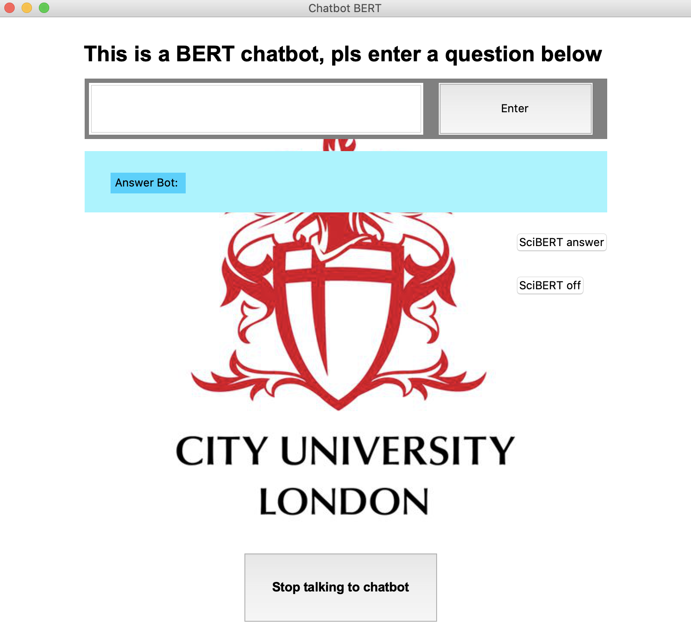

# BERT Chatbot 
The report of this repo can be found here [[report](./DL_Prediction_BERT.pdf)].
(old report update to latest)

This repo introduces a BERT Chatbot that is fine-tuned with Cornell Movie-Quotes Corpus to generate answers with a basic conversational model, as well as understanding when to answer with a more intelligent (trained on scientific papers) model.
## Model
We [fine-tune](./FineTune_SCI_and_BERT.py) the BertForMaskedLM model, this model has a language modeling head. To ensure that the BERT model only predicts words of the response, while still taking the question into context, we set the positions of masked lm labels that correspond with the question of the phrase pair and any padding added to the sequence to -100. For the indexes which correspond to the response phrase, masked lm labels has the same values as input ids.

## Word Generation
For the purposes of a conversational interface, we are required to generate text in a causal manner (left to right), and as BERT is bi-directional, it is not inherently able generate text in this way. For this reason, we implemented a similar method as explained in ”BERT has a Mouth, and It Must Speak: BERT as a Markov Random Field Language Model” (Wang and Cho 2019). With this method we add a [CLS] at the front of the input text, which is necessary as an input to BERT. Then we add a [SEP] showing the end of our question, after that we create mask tokens until the predefined maximum length of the phrase, a maximum length of 40 is chosen for our implementation. Finally at the end of the input phrase a [SEP]

## Dataset
The dataset used for fine-tuning is the Cornell Movie-Quotes Corpus that contains conversations form raw movie scripts. This repo only uses the [movie_lines.txt](./cornell_movie_dialogs_corpus/movie_lines.txt) and the [movie_conversations.txt](./cornell_movie_dialogs_corpus/movie_conversations.txt) files during training. The [movie_lines.txt](./cornell_movie_dialogs_corpus/movie_lines.txt) dataset contains the line-id, the character-id, the movie-id, the character-name and the text. The [movie_conversations.txt](./cornell_movie_dialogs_corpus/movie_conversations.txt) contains the different line-ids of text from a particular conversation as a sequence of dialogue lines.

From the parsed text, we construct a dataset of phrase pairs from all the phrases and the responses produced in a dialogue. For example, if a dialogue has four phrases A,B,C,D, then the phrase pairs that are added to our dataset are (A,B), (B,C), and (C,D).

## Accuracy metrics during training
During training we keep track of the performance of the model using BertScore and BLEU-score. Both of these metrics rely on a reference text being available, this to create a dataset with reference answers to predefined answers using this [file](./Metrics_files/Index_generation_Questions_F1_score.py). 

Three general questions are defined that are applicable for a chatbot; ”who is she?”, ”Are you okay?” and ”Why?”. For each of these questions a F1 score is calculated compared to the questions that are available in our questions dataset of the phrase pairs. If the question in the dataset has a F1 score higher than 0.9 this question can be seen as similar to our chosen question and the index is stored. From these indexes we then generate a dataset of answers, this dataset will be used as a reference to possible answers that the chatbot could generate for our question.

## Performance of the model 
The following graphs show the performance of our model during training.
<p align="center">
  
</p>

### Parameter tuning
#### Weight Decay
<p align="center">
  
</p>

#### Learning Rate
<p align="center">
  
</p>

#### Learning Rate Schedules
add graph

## Required packages
- Python 3.6
- Pytorch 
- bert-score 0.3.1
- numpy
- nltk
- panda
- pickle
- Tensorflow

## Usage
To run the interface:
```
python3.6 Chatbot_GUI.py
```

To trian a BERT model on the Cornell Movie Dialogue dataset:
```
python3.6 FineTune_SCI_and_BERT.py
```
Training parameters can be changed by editing the corresponding section in beginning of the code

## Other files
utils.py :  utility methods used for training <br/>
utils_generation.py : utilty methods used for text generation <br/>
Dataset_Q_A.py : classes need for dataset creation <br/>
bert_word_generation.py : file used to generate text <br/>
movie_lines.txt : text file containing movie line content with line IDs <br/>
movie_conversations : text file containing the sets of line IDs that consist of each dialogue <br/>
why_refs.txt : text file containing all the answers provided to the question "Why?" from the cornell dataset <br/>
who_is_she_refs.txt : text file containing all the answers provided to the question "Who is she?" from the cornell dataset <br/>
are_you_okay_refs.txt : text file containing all the answers provided to the question "Are you akoy?" from the cornell dataset <br/>

## Lay-Out graphical user interface
<p align="center">
  
</p>
